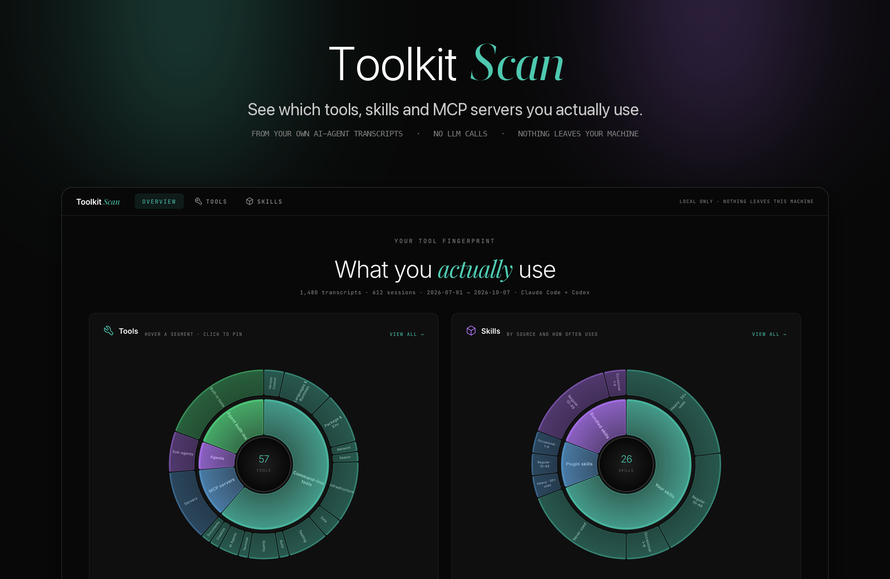
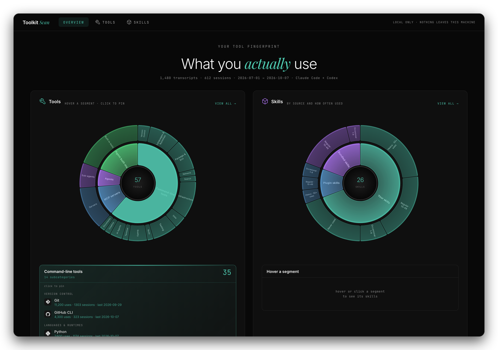
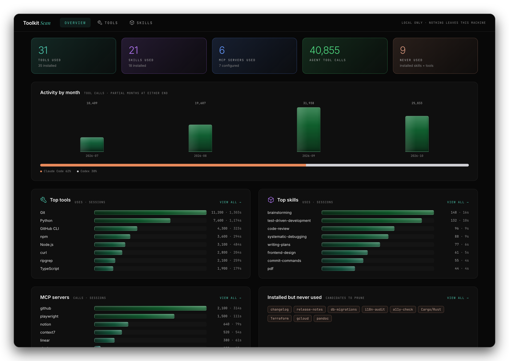
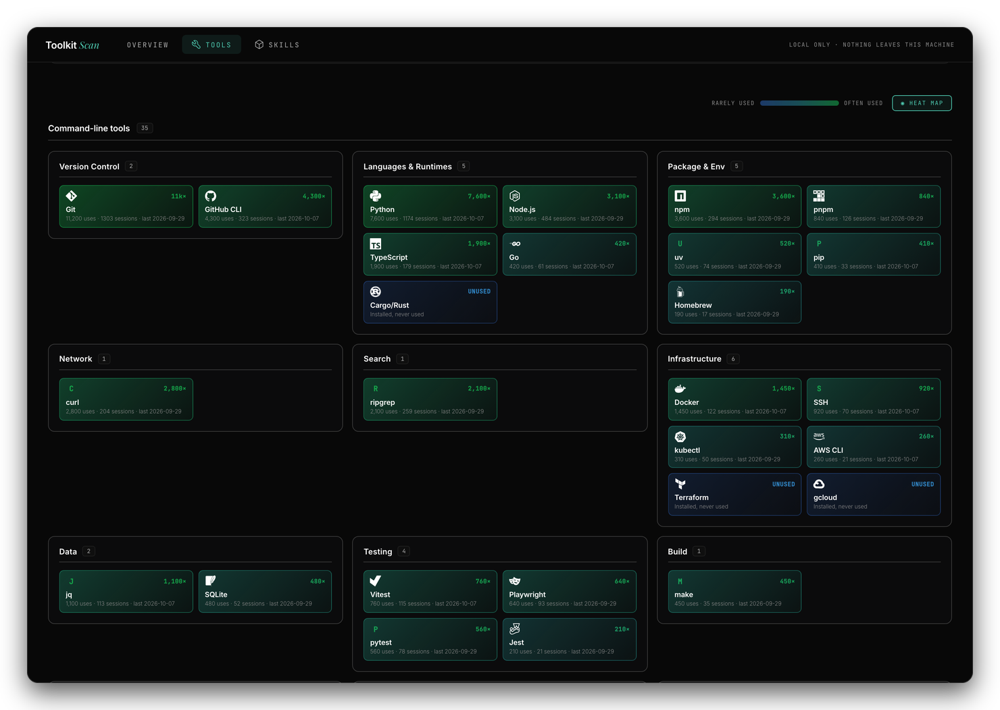
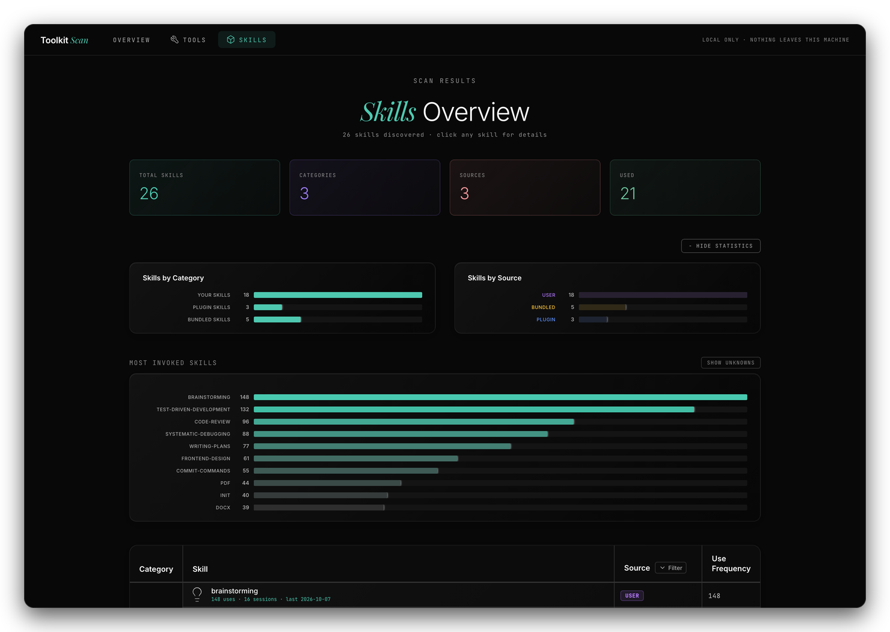
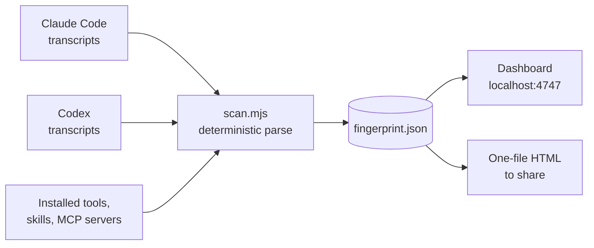

<div align="center">



<br>


**Your AI agent keeps a record of everything it does. Toolkit Scan reads it and shows you which tools, skills and MCP servers you actually use, and which ones you only think you do.**

</div>

---

## Try it in 30 seconds

You need [Node.js](https://nodejs.org) 18 or newer. There is nothing to install.

```bash
git clone https://github.com/AntHuntley/toolkit-scan.git
cd toolkit-scan
node toolkit-scan.mjs
```

It scans your transcripts (about 25 seconds for 6 GB of history), then opens the dashboard at <http://localhost:4747>.

No transcripts yet, or just curious? Open it with sample data:

```bash
node toolkit-scan.mjs --demo
```

> The screenshots in this README all use that sample data.

---

## What you get

### Overview: your fingerprint at a glance

Two sunbursts front and centre: **Tools** (grouped by category) and **Skills** (grouped by where they came from, then by how often you use them). Hover a segment to see what's in it; click to pin it.

<div align="center">

</div>

Scroll down for headline numbers, activity by month (Claude Code in orange, Codex in grey), your top tools, skills and MCP servers, and a list of everything you've installed but never used.

<div align="center">

</div>

### Tools: a heat map of what you reach for

Every tile is coloured by how often you use it: **dark blue for rarely used, shading to dark green for heavily used.** Tools you have installed but never touched stay blue and say so.

<div align="center">

</div>

### Skills: what's earning its keep

Every skill with its usage count, source (yours, plugin, bundled) and last-used date, plus the skills you've installed and never invoked.

<div align="center">

</div>

---

## How it works



- **Deterministic.** It counts structured events (tool calls, `Skill` invocations, `mcp__server__tool` names, the first word of each shell command). No LLM, no tokens, no network.
- **Fast.** Streams the files and only parses lines that can matter. About 25 seconds and 270 MB of memory for 3,000 files / 6 GB.
- **Cross-checked.** Skill counts were verified against an independent count of the same transcripts and matched exactly.
- **Installed vs used.** It compares what you have installed against what you actually used, which is how the "never used" list is built.

---

## Commands

| Command | What it does |
|---|---|
| `node toolkit-scan.mjs` | Scan, then open the dashboard on localhost |
| `node toolkit-scan.mjs --demo` | Open the dashboard with sample data (no transcripts needed) |
| `node toolkit-scan.mjs --share` | Scan, then write **one self-contained HTML file** you can send, host or publish |
| `node toolkit-scan.mjs --cached` | Skip the scan and reuse the last result |
| `node toolkit-scan.mjs --discover` | List the transcript folders it found, then exit |
| `node toolkit-scan.mjs --source <dir>` | Add a transcript folder (repeatable) |
| `node toolkit-scan.mjs --no-open` | Don't launch the browser |

Results are saved in `~/.toolkit-scan/`.

## Where it looks for transcripts

It checks the usual places and reads the file *format* (not the folder name) to pick the right parser:

- **Claude Code:** `$CLAUDE_CONFIG_DIR/projects`, `~/.claude/projects`, `~/.config/claude/projects`, plus Windows and macOS app-data variants
- **Codex:** `$CODEX_HOME/sessions`, `~/.codex/sessions`, `~/.codex/archived_sessions`
- **WSL:** Windows profile folders under `/mnt/c/Users/*`
- **Anything else:** pass `--source <dir>`, or list folders in `~/.toolkit-scan/sources.json`:

```json
{ "paths": ["/path/to/other/transcripts"] }
```

Run `--discover` to see what it found. If it finds nothing it tells you where it looked.

> **Let your agent help.** Ask it: *"Find where my agent transcripts are stored and add the folder to `~/.toolkit-scan/sources.json`."*

---

## Share your dashboard

```bash
node toolkit-scan.mjs --share
```

This writes `~/.toolkit-scan/toolkit-scan-share.html`: one file, your data embedded, no server needed. It works offline, can be emailed, dropped on any static host, or published as an artifact.

**To get a link:** ask Claude Code to publish the file as an artifact (private by default; you choose who can open it). Publishing needs a claude.ai account login. If you use an API key or a company proxy, send or host the file instead.

**What the shared file contains:** tool, skill and MCP-server **names with usage counts and dates**. **What it leaves out:** file paths, transcript folders, unrecognised commands, prompts and any transcript text.

> Open the file and look before you share it. Names of private skills or internal MCP servers will be in there.

---

## Privacy

- Everything runs on your machine. The dashboard is served on `127.0.0.1` only.
- Transcripts are read but never copied, uploaded or modified.
- The only network requests the page makes are for web fonts and tool icons.

## What's counted, and the limits

<details>
<summary>Details</summary>

- **Skills:** each invocation through the agent's `Skill` tool, plus `/slash` commands you type that match an installed skill. Codex has no Skill tool, so Codex skill use is **inferred** from reads of `SKILL.md` files.
- **Tools:** the command at the start of each shell command (`git`, `docker`, `npm`…) matched against a built-in catalogue of about 50 CLIs. Anything not in the catalogue is left out rather than guessed.
- **MCP servers:** tool calls named `mcp__<server>__<tool>`.
- **History window:** only transcripts still on disk. Claude Code deletes transcripts older than 30 days by default (`cleanupPeriodDays` in its settings), so older usage may be missing. The date range is shown at the top of the Overview.
- **Not supported yet:** Cursor, Copilot, and chat apps (their storage is different).
- **Windows / WSL:** paths are handled but not yet tested on a real Windows machine.

</details>

## Develop

```bash
npm install
npm run build        # rebuilds ui/ (localhost app) and ui-single/ (share template)
npm run dev:ui       # hot-reload the UI against a running `node server.mjs`
```

The UI source is in `app/`. The built output (`ui/`, `ui-single/`) is committed so users need no build step. The README images are regenerated from the sample data with `docs/make-screenshots.mjs` and `docs/compose.py`.

---

<div align="center"><sub>Toolkit Scan · deterministic, local-first, no tokens spent</sub></div>
