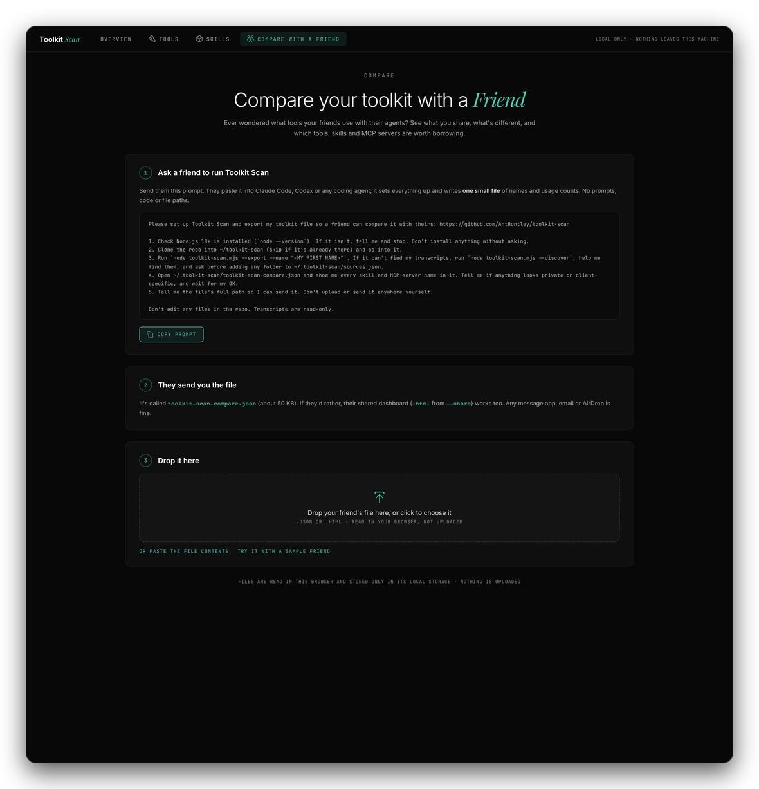
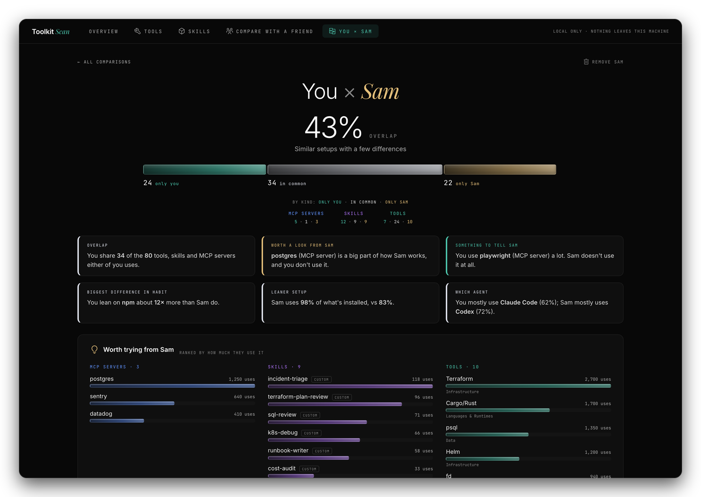
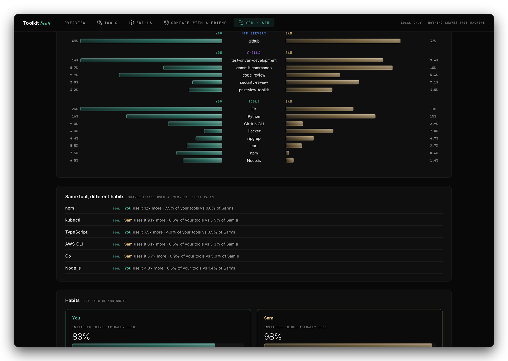
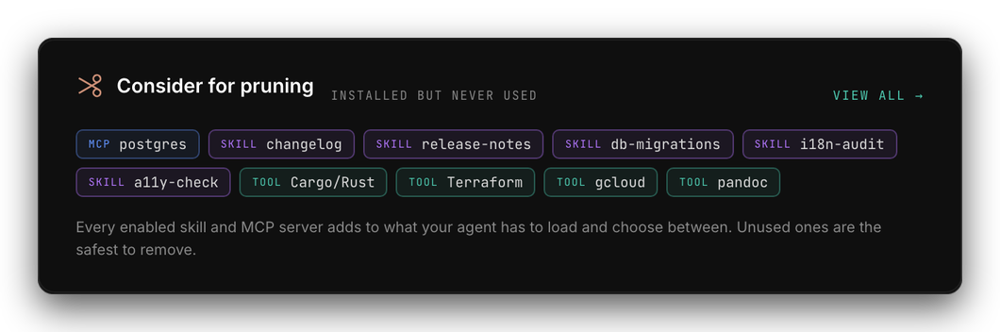
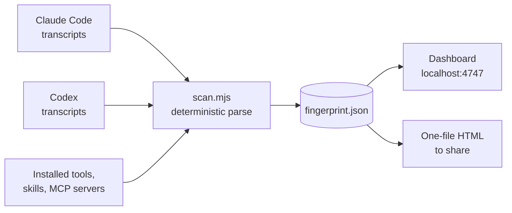

<div align="center">


<br>


**Your AI agent keeps a record of everything it does. Toolkit Scan reads it and shows you which tools, skills and MCP servers you actually use, and which ones you only think you do.**

</div>

---

## Quickstart

Paste this into Claude Code, Codex or any coding agent that can run commands on your machine. It does the rest. *(Hover the box and click the copy icon in its top-right corner.)*

```text
Set up and run "Toolkit Scan" for me: https://github.com/AntHuntley/toolkit-scan

1. Check Node.js 18+ is installed (`node --version`). If it isn't, tell me and stop. Don't install anything without asking.
2. Clone the repo into ~/toolkit-scan (skip if it's already there) and cd into it.
3. Run `node toolkit-scan.mjs --discover` and show me which transcript folders it found. If it found none, or only one agent, search for where my agent transcripts (.jsonl files) are stored, show me what you find, and ask before adding any folder to ~/.toolkit-scan/sources.json as {"paths":["<folder>"]}.
4. Run `node toolkit-scan.mjs` to scan and open the dashboard. Tell me the URL, how many transcripts and sessions it analysed, and the date range it covers.
5. Summarise what it found in a few lines: my most-used tools, skills and MCP servers, and what I've installed but never used.
6. Ask whether I want a shareable copy. If yes, run `node toolkit-scan.mjs --share`, list any skill or MCP-server names in it that look private or client-specific, and wait for my OK before sending or publishing the file anywhere.

Don't edit any files in the repo. Transcripts are read-only and must never be uploaded or copied.
```

> **If the agent can't clone the repo,** you probably don't have access to it yet. Ask the owner, or use the manual steps below.

> [!TIP]
> **Ever wondered what tools your friends are using with their agents?** Ask them to run this, then compare: see what you share, where you differ, and which tools or skills you might want to add to your own toolkit. The dashboard has a **Compare with a Friend** tab that makes it a one-minute job. [See how it works](#compare-with-a-friend).

---

## Try it in 30 seconds

You need [Node.js](https://nodejs.org) 18 or newer. There is nothing to install.

```bash
git clone https://github.com/AntHuntley/toolkit-scan.git
cd toolkit-scan
node toolkit-scan.mjs
```

It scans your transcripts (about 25 seconds for 6 GB of history), then opens the dashboard at <http://localhost:4747>.

No transcripts yet, or just curious? Open it with sample data:

```bash
node toolkit-scan.mjs --demo
```

> The screenshots in this README all use that sample data.

---

## What you get

### Overview: your fingerprint at a glance

Two sunbursts front and centre: **Tools** (grouped by category) and **Skills** (grouped by where they came from, then by how often you use them). Hover a segment to see what's in it; click to pin it.

<div align="center">

</div>

Scroll down for headline numbers, activity by month (Claude Code in orange, Codex in grey), your top tools, skills and MCP servers, and a list of everything you've installed but never used.

<div align="center">

</div>

### Tools: a heat map of what you reach for

Every tile is coloured by how often you use it: **dark blue for rarely used, shading to dark green for heavily used.** Tools you have installed but never touched stay blue and say so.

<div align="center">

</div>

### Skills: what's earning its keep

Every skill with its usage count, source (yours, plugin, bundled) and last-used date, plus the skills you've installed and never invoked.

<div align="center">

</div>

---

## Compare with a friend

Open the **Compare with a Friend** tab. It walks you through it:

<div align="center">

</div>

1. **Send your friend the prompt** (the tab has a copy button). They paste it into Claude Code, Codex or any coding agent. It sets Toolkit Scan up and writes one small file of names and usage counts: no prompts, code or file paths.
2. **They send you the file**, `toolkit-scan-compare.json` (about 50 KB). Their shared dashboard (`.html` from `--share`) works too.
3. **Drop it on the tab.** A new tab, **You × Sam**, appears with the comparison. Add as many friends as you like; each gets its own tab.

Prefer to send it yourself? This is the prompt your friend runs:

```text
Please set up Toolkit Scan and export my toolkit file so a friend can compare it with theirs: https://github.com/AntHuntley/toolkit-scan

1. Check Node.js 18+ is installed (`node --version`). If it isn't, tell me and stop. Don't install anything without asking.
2. Clone the repo into ~/toolkit-scan (skip if it's already there) and cd into it.
3. Run `node toolkit-scan.mjs --export --name "<MY FIRST NAME>"`. If it can't find my transcripts, run `node toolkit-scan.mjs --discover`, help me find them, and ask before adding any folder to ~/.toolkit-scan/sources.json.
4. Open ~/.toolkit-scan/toolkit-scan-compare.json and show me every skill and MCP-server name in it. Tell me if anything looks private or client-specific, and wait for my OK.
5. Tell me the file's full path so I can send it. Don't upload or send it anywhere yourself.

Don't edit any files in the repo. Transcripts are read-only.
```

### What the comparison shows

<div align="center">

</div>

- **Overlap.** One number for how alike your toolkits are, and a bar splitting everything into *only you*, *in common* and *only them*, by tools, skills and MCP servers.
- **Highlights.** The few things most worth knowing, in plain sentences: what's worth a look, what you could tell them about, your biggest difference in habit.
- **Worth trying.** Everything they use that you don't, ranked by how much they rely on it. Their custom skills are marked, since those are theirs to share; plugin and built-in ones you can install yourself.
- **You could tell them about.** The same list the other way round.
- **In common.** The things you both use, side by side, as a share of each person's own usage.
- **Same tool, different habits.** Shared tools you lean on very differently (for example *Sam uses kubectl 9× more*).
- **Habits.** How much of what's installed each of you actually uses, how broad your toolkits are, which agent you favour, and where your tool usage goes by category.

<div align="center">

</div>

**Fair by design.** Two people's histories are rarely the same length, so the comparison uses *who uses what* and *each person's share of their own usage*, never raw counts. The date range for each of you is shown at the bottom.

**Private by design.** The file holds tool, skill and MCP-server names with usage counts and dates. Your friend's file is read in your browser and saved only in that browser's local storage; nothing is uploaded. Remove a friend any time from their tab.

---

## Keep your toolkit lean

The Overview ends with a **Consider for pruning** panel: every MCP server, skill and tool you have installed but never used in the history that was scanned.

<div align="center">

</div>

**Why bother?**

- **Less context, lower cost.** Your agent loads the name and description of every enabled skill, and the tool definitions of every connected MCP server, into its context. That space (and the tokens, on metered plans) is spent before you've typed anything, on things you never use.
- **Better choices.** The more overlapping skills and tools an agent can pick from, the more likely it is to reach for the wrong one or trigger a skill you didn't intend. A smaller set is easier to choose well from.
- **Steadier sessions.** An MCP server is usually a process that has to start and stay healthy. Unused ones are start-up time and something else that can fail.
- **Smaller attack surface.** Skills and MCP servers can run code and reach your files, accounts and network. Each one you keep is something you have to trust and keep up to date.
- **Less to maintain.** Fewer things to update, audit and explain to teammates.

**How to act on it**

1. **Check the date range first.** "Never used" only means never used in the scanned history, and Claude Code keeps 30 days of transcripts by default. Seasonal or occasional tools can look unused.
2. **Start with MCP servers, then skills, then tools.** MCP servers usually cost the most to keep loaded. In Claude Code, for example, `claude mcp remove <name>` takes one out.
3. **Move skills aside instead of deleting them.** Take the folder out of `~/.claude/skills` (or `~/.codex/skills`) so it's easy to put back.
4. **Rescan after a week** to see whether you missed any of them.

---

## How it works



- **Deterministic.** It counts structured events (tool calls, `Skill` invocations, `mcp__server__tool` names, the first word of each shell command). No LLM, no tokens, no network.
- **Fast.** Streams the files and only parses lines that can matter. About 25 seconds and 270 MB of memory for 3,000 files / 6 GB.
- **Cross-checked.** Skill counts were verified against an independent count of the same transcripts and matched exactly.
- **Installed vs used.** It compares what you have installed against what you actually used, which is how the "never used" list is built.

---

## Commands

| Command | What it does |
|---|---|
| `node toolkit-scan.mjs` | Scan, then open the dashboard on localhost |
| `node toolkit-scan.mjs --demo` | Open the dashboard with sample data (no transcripts needed) |
| `node toolkit-scan.mjs --share` | Scan, then write **one self-contained HTML file** you can send, host or publish |
| `node toolkit-scan.mjs --export --name "Sam"` | Scan, then write a small file (`~/.toolkit-scan/toolkit-scan-compare.json`) to send to a friend for the Compare tab |
| `node toolkit-scan.mjs --cached` | Skip the scan and reuse the last result |
| `node toolkit-scan.mjs --discover` | List the transcript folders it found, then exit |
| `node toolkit-scan.mjs --source <dir>` | Add a transcript folder (repeatable) |
| `node toolkit-scan.mjs --no-open` | Don't launch the browser |

Results are saved in `~/.toolkit-scan/`.

## Where it looks for transcripts

It checks the usual places and reads the file *format* (not the folder name) to pick the right parser:

- **Claude Code:** `$CLAUDE_CONFIG_DIR/projects`, `~/.claude/projects`, `~/.config/claude/projects`, plus Windows and macOS app-data variants
- **Codex:** `$CODEX_HOME/sessions`, `~/.codex/sessions`, `~/.codex/archived_sessions`
- **WSL:** Windows profile folders under `/mnt/c/Users/*`
- **Anything else:** pass `--source <dir>`, or list folders in `~/.toolkit-scan/sources.json`:

```json
{ "paths": ["/path/to/other/transcripts"] }
```

Run `--discover` to see what it found. If it finds nothing it tells you where it looked.

> **Let your agent help.** Ask it: *"Find where my agent transcripts are stored and add the folder to `~/.toolkit-scan/sources.json`."*

---

## Share your dashboard

```bash
node toolkit-scan.mjs --share
```

This writes `~/.toolkit-scan/toolkit-scan-share.html`: one file, your data embedded, no server needed. It works offline, can be emailed, dropped on any static host, or published as an artifact.

**To get a link:** ask Claude Code to publish the file as an artifact (private by default; you choose who can open it). Publishing needs a claude.ai account login. If you use an API key or a company proxy, send or host the file instead.

**What the shared file contains:** tool, skill and MCP-server **names with usage counts and dates**. **What it leaves out:** file paths, transcript folders, unrecognised commands, prompts and any transcript text.

> Open the file and look before you share it. Names of private skills or internal MCP servers will be in there.

---

## Privacy

- Everything runs on your machine. The dashboard is served on `127.0.0.1` only.
- Transcripts are read but never copied, uploaded or modified.
- The only network requests the page makes are for web fonts and tool icons.

## What's counted, and the limits

<details>
<summary>Details</summary>

- **Skills:** each invocation through the agent's `Skill` tool, plus `/slash` commands you type that match an installed skill. Codex has no Skill tool, so Codex skill use is **inferred** from reads of `SKILL.md` files.
- **Tools:** the command at the start of each shell command (`git`, `docker`, `npm`…) matched against a built-in catalogue of about 50 CLIs. Anything not in the catalogue is left out rather than guessed.
- **MCP servers:** tool calls named `mcp__<server>__<tool>`.
- **History window:** only transcripts still on disk. Claude Code deletes transcripts older than 30 days by default (`cleanupPeriodDays` in its settings), so older usage may be missing. The date range is shown at the top of the Overview.
- **Not supported yet:** Cursor, Copilot, and chat apps (their storage is different).
- **Windows / WSL:** paths are handled but not yet tested on a real Windows machine.

</details>

## Develop

```bash
npm install
npm run build        # rebuilds ui/ (localhost app) and ui-single/ (share template)
npm run dev:ui       # hot-reload the UI against a running `node server.mjs`
```

The UI source is in `app/`. The built output (`ui/`, `ui-single/`) is committed so users need no build step. The README images are regenerated from the sample data with `docs/make-screenshots.mjs` and `docs/compose.py`.

---

<div align="center"><sub>Toolkit Scan · deterministic, local-first, no tokens spent</sub></div>

<div align="center">
  <a href="https://www.buymeacoffee.com/AntHuntley"></a>
</div>
